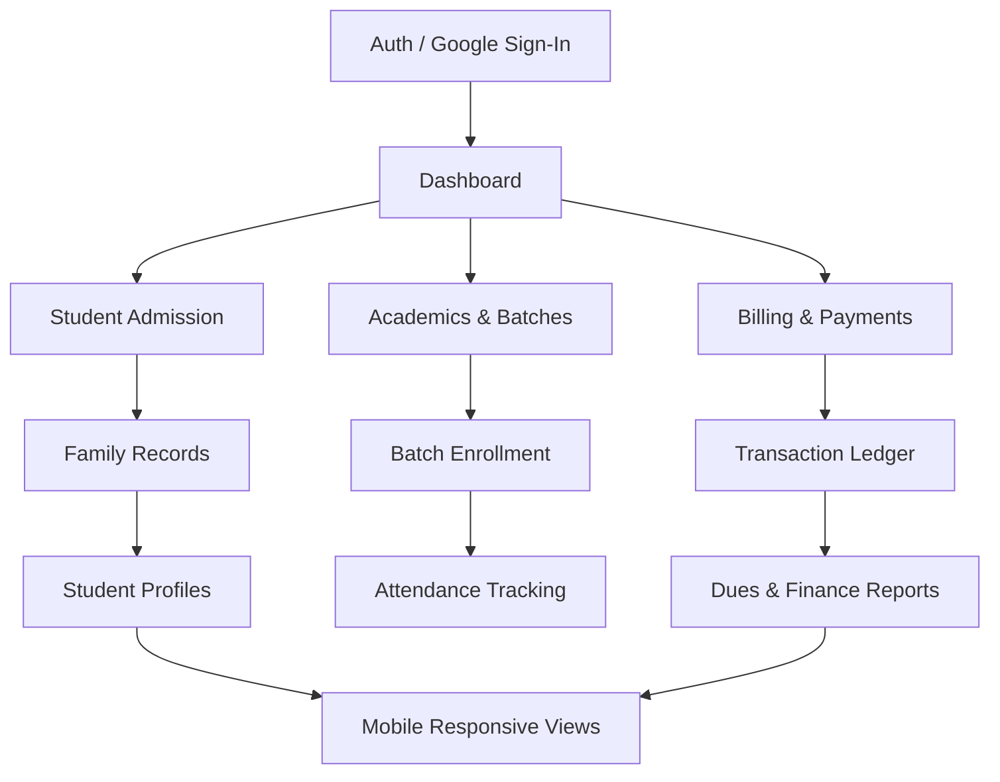

# RK Institute ERP

> [!NOTE]
> **Status**: 🛠️ Active Development | 🧪 Comprehensive QA Verified (v1.1)

A professional tuition management system built with Next.js 15, designed for high-performance student admission, multi-modal fee collection, and intelligent academic scheduling.

---

## 📚 Documentation

For detailed guides and verification steps, refer to:

- 📖 **[User Manual](docs/user-manual.md)**: Interactive guide with visual workflows, screenshots, and step-by-step module instructions.
- ✅ **[QA Checklist](docs/qa-checklist.md)**: Comprehensive 50-point report covering authentication, billing, academics, and responsive testing.

---

## 🗺️ Application Map

Visualize how core modules interact:



---

## 🚀 Tech Stack

- **Framework:** Next.js 15 (App Router, Server Actions)
- **Database:** PostgreSQL (Neon Serverless)
- **ORM:** Drizzle ORM
- **Auth:** NextAuth.js v5 (Credentials & Google OAuth)
- **UI Architecture:** Tailwind CSS + Radix UI + shadcn/ui
- **Validation:** Zod (Type-safe schemas)
- **Testing:** Vitest (Unit) + Playwright (E2E & Responsive)

---

## 🏗️ Project Structure

```text
.
├── docs/                   # User Manual, QA Checklist, and Screenshots
├── scripts/                # Utility scripts (seeding, indexing, migrations)
├── tests/
│   ├── unit/               # Vitest unit tests for business logic
│   └── e2e/                # Playwright E2E and Responsive tests
├── src/
│   ├── app/                # Next.js App Router (Pages & API)
│   ├── actions/            # Server Actions (Business Logic Layer)
│   │   ├── admission.ts     # Family & Student creation
│   │   ├── billing.ts       # Payment processing & balance logic
│   │   └── academics.ts     # Batch management
│   ├── components/         # React Components (UI & Logic)
│   ├── db/                 # Drizzle Schema & Connection
│   └── lib/                # Shared utilities & validations
```

---

## 📋 Quick Start

### 1. Installation
```bash
git clone <repository-url>
cd rk-institute-erp
npm install
```

### 2. Environment Configuration
Create a `.env` file from `.env.example` (if available) or use:
```env
DATABASE_URL=postgresql://...
AUTH_SECRET=...
NEXTAUTH_URL=http://localhost:3000
```

### 3. Database & Dev
```bash
npx drizzle-kit push      # Sync schema
npm run dev               # Start server
```

---

## 🧪 Testing Strategy

We follow a two-tier testing approach:

### Unit Testing (Vitest)
Tests core business logic such as pro-rata calculations and date handling.
```bash
npm run test:run
```

### E2E & Responsive Testing (Playwright)
Validates user flows across Chrome, Tablet (iPad), and Mobile (Pixel/iPhone) viewports.
```bash
npm run test:e2e
```

---

## 🔐 User Roles & Permissions

- **Super Admin**: System configuration, audit logs, and high-level overrides.
- **Admin**: Staff management, academics, and financial oversight.
- **Staff**: Daily operations (Admissions, Attendance, Fee Collection).

---

## 📜 License & Contribution

- **License**: Private - RK Institute
- **Workflow**: Follow the [Development Standard](.agent/workflows/development-standard.md) for branching and PRs.
