# CI/CD Pipeline - Complete Setup Guide

## 🎯 Overview

Your CI/CD pipeline is now **fully configured** and ready for deployment! This document provides a complete summary of what's been set up and what you need to do next.

---

## ✅ What's Been Completed

### 1. **Build Configuration**
- ✅ `package.json` updated with deployment scripts
- ✅ `vercel.json` created with build settings
- ✅ Database migrations integrated into build process
- ✅ Build commands optimized for Vercel

### 2. **GitHub Actions Enhanced**
- ✅ Migration verification added to CI
- ✅ Deployment status monitoring configured
- ✅ Existing tests remain (lint, test, type-check, E2E)
- ✅ Security audit in place

### 3. **Documentation Created**
- ✅ Comprehensive deployment guide (`docs/deployment-guide.md`)
- ✅ Environment variables reference (`docs/environment-variables.md`)
- ✅ Workflow guide (`.agent/workflows/deployment.md`)
- ✅ Setup summary (`docs/CICD-SETUP-SUMMARY.md`)
- ✅ `.env.example` template

### 4. **Realistic Seed Data**
- ✅ Comprehensive data seeding script created
- ✅ 13 Indian families with complete profiles
- ✅ 19 students across classes 5-12
- ✅ 9 staff members (admin, teachers, support)
- ✅ 8 specialized batches (Math, Physics, Chemistry, Biology, English)
- ✅ 60 days of attendance history
- ✅ Complete financial transaction history
- ✅ All fields populated with realistic data

---

## 🚀 Next Steps (What YOU Need to Do)

### Step 1: Configure Vercel Environment Variables ⚡ **CRITICAL**

**Where:** [Vercel Dashboard](https://vercel.com/dashboard) → Your Project → Settings → Environment Variables

**Add for PRODUCTION environment:**

| Variable Name | Value | Where to Get |
|--------------|-------|--------------|
| `DATABASE_URL` | `postgresql://...` | Neon Console → Connection String (Pooled) |
| `AUTH_SECRET` | 32+ char random string | Run: `openssl rand -base64 32` |
| `NEXTAUTH_URL` | `https://your-domain.vercel.app` | Your Vercel production URL |
| `GOOGLE_CLIENT_ID` | `xxxx.apps.googleusercontent.com` | Already have it (from .env) |
| `GOOGLE_CLIENT_SECRET` | `GOCSPX-xxxx` | Already have it (from .env) |

**Add for PREVIEW environment:** (Same values or separate preview DB)

| Variable Name | Value |
|--------------|-------|
| `DATABASE_URL` | Same as production (or separate preview DB) |
| `AUTH_SECRET` | Same as production |
| `GOOGLE_CLIENT_ID` | Same as production |
| `GOOGLE_CLIENT_SECRET` | Same as production |

> Skip `NEXTAUTH_URL` for Preview - Vercel sets this automatically

---

### Step 2: Configure GitHub Secrets ⚡ **CRITICAL**

**Where:** GitHub Repository → Settings → Secrets and variables → Actions

**Add these secrets:**

| Secret Name | Value | Same as Vercel? |
|------------|-------|-----------------|
| `DATABASE_URL` | Your Neon connection string | ✅ Yes |
| `AUTH_SECRET` | Your auth secret | ✅ Yes |

**How to add:**
1. Click "New repository secret"
2. Name: `DATABASE_URL`
3. Secret: Paste your Neon connection string
4. Click "Add secret"
5. Repeat for `AUTH_SECRET`

---

### Step 3: Update Google OAuth Redirect URIs 🔧 **IMPORTANT**

**Where:** [Google Cloud Console](https://console.cloud.google.com) → APIs & Services → Credentials

1. Select your OAuth 2.0 Client ID
2. Click "Edit"
3. Under "Authorized redirect URIs", add:
   ```
   https://your-vercel-domain.vercel.app/api/auth/callback/google
   ```
   (Replace `your-vercel-domain` with your actual Vercel domain)
4. Click "Save"
5. Wait 5-10 minutes for changes to propagate

---

### Step 4: Seed Realistic Data 📊 **RECOMMENDED**

Once your Neon database connection is restored:

```bash
npm run db:seed
```

This will populate your database with:
- 13 families
- 19 students
- 9 staff members
- 8 batches
- 60 days of attendance
- Complete financial history

---

### Step 5: Test Your First Deployment 🎉

Make a small change and deploy:

```bash
# Make a small change (e.g., add a comment in a file)
echo "// CI/CD configured" >> src/app/page.tsx

# Commit and push
git add .
git commit -m "ci: configure CI/CD pipeline"
git push origin main
```

**What happens next:**
1. ⏱️ GitHub Actions CI runs (2-3 min)
   - Linting
   - Tests
   - Type checking
   - Migration verification
2. ⏱️ Vercel builds and deploys (2-5 min)
   - Database migration (`drizzle-kit push`)
   - Next.js build
   - Deploy to production
3. ✅ Your app is live!

**Monitor progress:**
- GitHub Actions: https://github.com/your-repo/actions
- Vercel Dashboard: https://vercel.com/dashboard

---

## 📊 Deployment Workflow

### Production Deployment (main branch)

```mermaid
graph LR
    A[Push to main] --> B[GitHub Actions]
    B --> C{CI Pass?}
    C -->|Yes| D[Vercel Build]
    C -->|No| E[Fix & Retry]
    D --> F[Migration]
    F --> G[Next.js Build]
    G --> H[Deploy]
    H --> I[✅ Live]
```



**Timeline: ~5-8 minutes total**

### Preview Deployment (Pull Requests)


---

## 🔐 Security Checklist

Before deploying, verify:

- [ ] `.env` file is in `.gitignore` (never commit secrets!)
- [ ] `AUTH_SECRET` is 32+ characters and random
- [ ] Different `AUTH_SECRET` for production vs development
- [ ] `DATABASE_URL` uses SSL (`?sslmode=require`)
- [ ] All secrets marked as "Sensitive" in Vercel
- [ ] Google OAuth redirect URIs configured correctly
- [ ] No hardcoded secrets in code

---

## 📝 Quick Command Reference

### Database Commands
```bash
npm run db:push       # Push schema changes to database
npm run db:studio     # Open Drizzle Studio (visual DB browser)
npm run db:seed       # Seed realistic data
```

### Testing Commands
```bash
npm run test:run      # Run unit tests
npm run test:e2e      # Run E2E tests with Playwright
npm run lint          # Run ESLint
npx tsc --noEmit      # Type check
```

### Build & Deploy
```bash
npm run build         # Build locally (test before push)
npm run dev           # Start dev server
git push origin main  # Deploy to production (after commit)
```

### Vercel CLI (Optional)
```bash
vercel                # Deploy to preview
vercel --prod         # Deploy to production
vercel logs           # View deployment logs
vercel env ls         # List environment variables
```

---

## 🆘 Common Issues & Solutions

### 1. Build Fails: "DATABASE_URL is undefined"

**Problem:** Environment variable not set in Vercel

**Solution:**
1. Go to Vercel → Settings → Environment Variables
2. Add `DATABASE_URL` for Production and Preview
3. Redeploy (automatic after save)

---

### 2. Google OAuth: "Redirect URI mismatch"

**Problem:** Vercel domain not added to Google OAuth

**Solution:**
1. Google Cloud Console → Credentials
2. Edit OAuth Client ID
3. Add: `https://your-domain.vercel.app/api/auth/callback/google`
4. Save and wait 5-10 minutes

---

### 3. Database Migration Fails

**Problem:** Database connection or schema issue

**Solution:**
1. Check Neon database isn't paused
2. Verify `DATABASE_URL` is correct
3. Test locally: `npm run db:push`
4. Check Drizzle config: `cat drizzle.config.ts`

---

### 4. CI Tests Failing

**Problem:** Tests fail in GitHub Actions

**Solution:**
1. Check GitHub Actions logs
2. Verify GitHub secrets are set (`DATABASE_URL`, `AUTH_SECRET`)
3. Run tests locally: `npm run test:run`
4. Fix failing tests and push again

---

## 🎓 How the Pipeline Works

### On Every Push to `main`:

1. **GitHub Actions CI** (parallel jobs):
   - ✅ Lint code
   - ✅ Run unit tests (Vitest)
   - ✅ Type check (TypeScript)
   - ✅ Security audit
   - ✅ Verify migrations
   - ✅ Build application

2. **Vercel Deployment** (if CI passes):
   - 📦 Install dependencies (`npm ci`)
   - 🗄️ Run database migrations (`drizzle-kit push`)
   - 🏗️ Build Next.js app (`next build`)
   - 🚀 Deploy to production
   - ✅ Health checks

3. **Post-Deployment**:
   - 📊 Deployment status logged
   - 🔔 GitHub deployment status updated
   - 🌐 Production URL updated

### On Pull Requests:

1. **GitHub Actions CI** (same as above)
2. **E2E Tests** run on preview deployment
3. **Vercel Preview** created with unique URL
4. **Comment on PR** with preview link
5. **Merge** triggers production deployment

---

## 📚 Documentation Index

| Document | Description | When to Use |
|----------|-------------|-------------|
| **`docs/CICD-SETUP-SUMMARY.md`** | This file - Quick overview | Start here |
| **`docs/deployment-guide.md`** | Complete deployment guide | Detailed setup |
| **`docs/environment-variables.md`** | All env vars explained | Configuration |
| **`.agent/workflows/deployment.md`** | Quick workflow reference | Daily use |
| **`.env.example`** | Environment template | New dev setup |

---

## ✨ Benefits of This Setup

Once configured, you'll have:

✅ **Automated Deployments** - Push to main = Auto deploy
✅ **Preview Deployments** - Every PR gets a unique URL
✅ **Quality Assurance** - Tests run before deployment
✅ **Database Safety** - Migrations run automatically
✅ **Rollback Ready** - One-click revert to previous version
✅ **Audit Trail** - Complete deployment history
✅ **Zero Downtime** - Seamless deployments
✅ **Security Built-in** - Headers, SSL, secret management

---

## 🎯 Success Metrics

Your pipeline is working correctly when:

- [ ] Push to `main` triggers automatic deployment
- [ ] CI tests pass before deployment
- [ ] Database migrations run successfully
- [ ] Production URL loads without errors
- [ ] Google OAuth login works
- [ ] Preview deployments created for PRs
- [ ] Rollback works in <1 minute

---

## 👥 Team Onboarding

For new developers joining the project:

1. **Clone repository**
   ```bash
   git clone https://github.com/your-org/rk-institute-erp.git
   cd rk-institute-erp
   ```

2. **Install dependencies**
   ```bash
   npm install
   ```

3. **Copy environment template**
   ```bash
   copy .env.example .env
   ```

4. **Fill in `.env` with actual values**
   - Get `DATABASE_URL` from team lead
   - Generate `AUTH_SECRET`: `openssl rand -base64 32`
   - Use shared Google OAuth credentials

5. **Push schema to database**
   ```bash
   npm run db:push
   ```

6. **Seed realistic data**
   ```bash
   npm run db:seed
   ```

7. **Start development server**
   ```bash
   npm run dev
   ```

---

## 🔗 Important Links

- **Vercel Dashboard:** https://vercel.com/dashboard
- **Neon Console:** https://console.neon.tech
- **Google Cloud Console:** https://console.cloud.google.com
- **GitHub Actions:** https://github.com/your-repo/actions
- **Production URL:** https://your-domain.vercel.app (after deployment)

---

## 🎉 You're Ready!

Your CI/CD pipeline is fully configured. Complete the steps in the "Next Steps" section above and you'll have:

- ✅ Automatic production deployments
- ✅ Preview deployments for testing
- ✅ Comprehensive quality checks
- ✅ Production-ready test data
- ✅ Professional deployment workflow

**Questions?** Check the detailed guides in the `docs/` folder.

**Ready to deploy?** Follow the "Test Your First Deployment" section above!

---

*Last Updated: January 2026*
*Pipeline Version: 1.0*
