# RK Institute ERP - User Manual

> [!NOTE]
> **Version**: 1.1 (Interactive)  
> **Last Updated**: January 18, 2026  
> **Status**: Comprehensive QA Verified

---

## 🧭 Navigation Hub

Explore the manual by category:

| 🏗️ **Setup** | 🏃 **Daily Ops** | 📊 **Insights** | 🛠️ **System** |
| :--- | :--- | :--- | :--- |
| [Getting Started](#-getting-started) | [Student Admission](#-student-admission) | [Dues Report](#-dues-report) | [Staff Management](#-staff-management) |
| [Login & Auth](#-login--authentication) | [Student Management](#-student-management) | [Finance Report](#-reports) | [Academic Sessions](#-academic-sessions) |
| [Keyboard Shortcuts](#-keyboard-shortcuts) | [Fee Collection](#-fee-collection) | [Audit Logs](#-audit-logs) | [System Settings](#-settings) |

---

## 🗺️ Application Map

Visualize how core modules interact with each other:

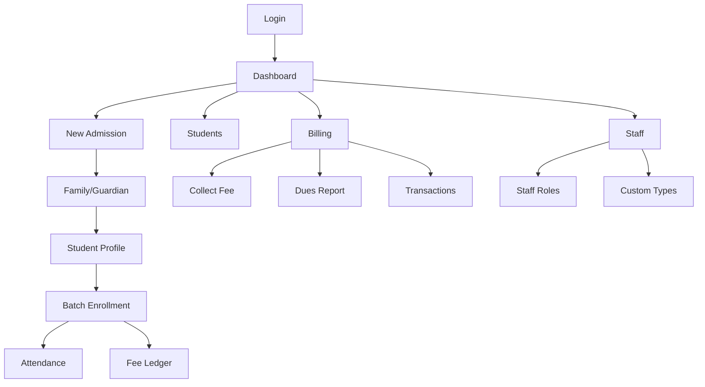

---

## 🚀 Getting Started

### 📝 Initial Checklist
- [x] Access URL: `http://localhost:3000`
- [x] Use Google Chrome for best experience
- [x] Admin credentials verified

### 🔑 Test Credentials
| Role | Email | Password |
|------|-------|----------|
| **Admin** | `admin@rkinstitute.com` | `admin123` |

---

## 🔐 Login & Authentication

````carousel
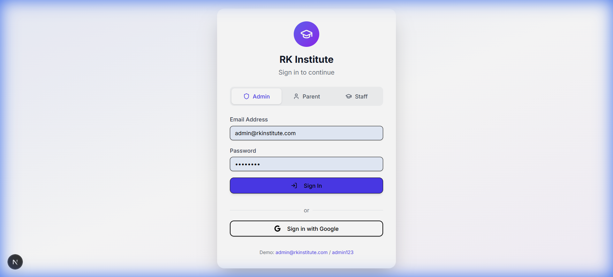
<!-- slide -->
### Authentication Workflow
1. **Role Select**: Choose Admin, Parent, or Staff.
2. **Credentials**: Enter email and password.
3. **Google Auth**: Alternative one-click login.
4. **Verification**: New users require admin approval.
````

> [!TIP]
> Use the **Demo Credentials** helper at the bottom of the login page for quick access during training.

---

## 📊 Dashboard (Command Center)

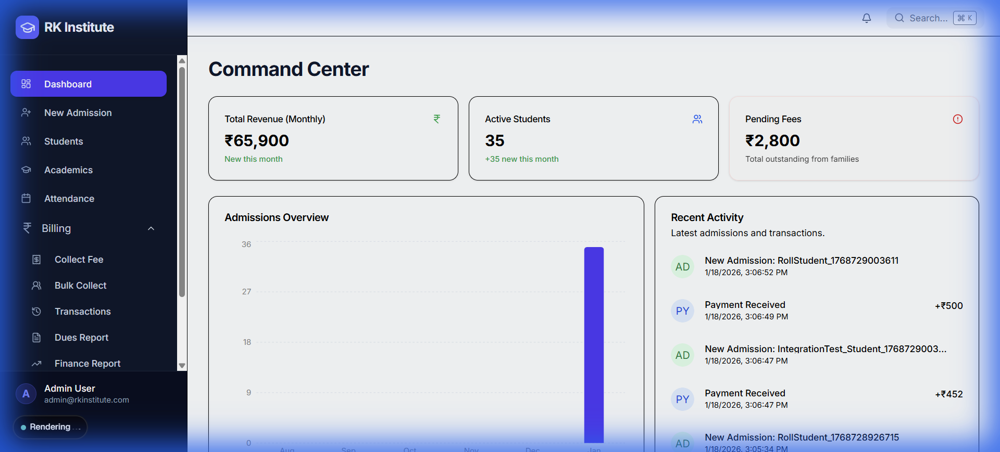

### Quick Metrics Guide
- **Total Revenue**: Monthly collected amount with trend indicator.
- **Active Students**: Count of verified, enrolled students.
- **Pending Fees**: Cumulative outstanding balance across all families.

> [!IMPORTANT]
> Click any Metric Card to jump directly to the detailed report for that specific metric.

---

## Getting Started

### System Requirements
- **Browser**: Google Chrome (recommended)
- **Internet**: Stable internet connection required
- **Screen**: Minimum 320px width (mobile-friendly)

### Access URL
```
https://[your-domain]/login
```

---

## Login & Authentication

### Login Page Overview


The login page features:
- **RK Institute** branding with graduation cap logo
- **Role Selection Tabs**: Admin, Parent, Staff
- **Email Address** input field
- **Password** input field (masked)
- **Sign In** button (primary action)
- **Sign in with Google** button (alternative login)
- **Demo Credentials** displayed at bottom for testing

### Login Steps

1. Navigate to the application URL (e.g., `https://your-domain/login`)
2. Select your role tab:
   - **Admin** - For administrative access
   - **Parent** - For parent/guardian access
   - **Staff** - For staff member access
3. Enter your registered **Email Address**
4. Enter your **Password**
5. Click the **Sign In** button
6. On successful login, you will be redirected to the Dashboard

### Google Sign-In (If Enabled)

1. Click the **Sign in with Google** button
2. Select your Google account from the popup
3. Authorize the application access
4. You will be automatically redirected to the Dashboard

### Account Verification

- New users require administrator verification
- Unverified users see a "Verification Pending" page after login
- Contact your administrator to get verified and assigned appropriate roles

### Troubleshooting Login Issues

| Issue | Solution |
|-------|----------|
| Invalid credentials | Check email case sensitivity and password |
| Account not verified | Contact administrator for verification |
| Forgot password | Contact administrator for password reset |
| Google login fails | Ensure Google authentication is enabled |
| Page not loading | Check internet connection, try refreshing |

---

## Dashboard (Command Center)


### Overview

The Dashboard (Command Center) is your central hub for managing the institute. It provides real-time metrics, recent activity, and quick access to all modules.

### Sidebar Navigation

The left sidebar provides access to all application modules:

| Icon | Module | Description |
|------|--------|-------------|
| 🏠 | **Dashboard** | Command Center (current page) |
| ➕ | **New Admission** | Admit new students to the institute |
| 👨‍🎓 | **Students** | View and manage all students |
| 📚 | **Academics** | Manage batches and enrollments |
| 📝 | **Attendance** | Track student attendance |
| 👥 | **Staff** | Manage staff members |
| 💰 | **Billing** | Fee collection submenu |
| ⚙️ | **Settings** | System configuration (Admin only) |

**Billing Dropdown Menu:**
- Collect Fee
- Bulk Collect
- Transactions
- Dues Report
- Finance Report

### Key Metrics Cards

Three primary metrics are displayed at the top:

1. **Total Revenue (Monthly)**
   - Current month's collected fees
   - Shows trend compared to last month
   - Green color indicates positive performance

2. **Active Students**
   - Total number of currently enrolled students
   - Shows new enrollments this month

3. **Pending Fees**
   - Total outstanding dues from all families
   - Red indicator for attention needed
   - Click to view detailed dues report

### Admissions Overview Chart

A bar chart visualizing:
- Monthly admission trends
- Comparison across recent months
- Helps identify enrollment patterns

### Recent Activity Panel

Displays the latest transactions and events:
- **AD** (Admission indicator) - New student admissions
- **PY** (Payment indicator) - Fee payments received
- Shows student name, timestamp, and amount
- Quick reference for recent operations

### Top Navigation Bar

- **Search Bar**: Quick search with keyboard shortcut `⌘/Ctrl + K`
- **Notification Bell**: View system notifications and alerts
- **User Profile**: Displayed in sidebar footer with Sign Out option

### Quick Actions from Dashboard

1. **Collect Fee**: Click billing dropdown → "Collect Fee"
2. **New Admission**: Click "New Admission" in sidebar
3. **View Students**: Click "Students" in sidebar
4. **Check Dues**: Click billing dropdown → "Dues Report"

---

---

## 📝 Student Admission

### 🔄 Admission Workflow
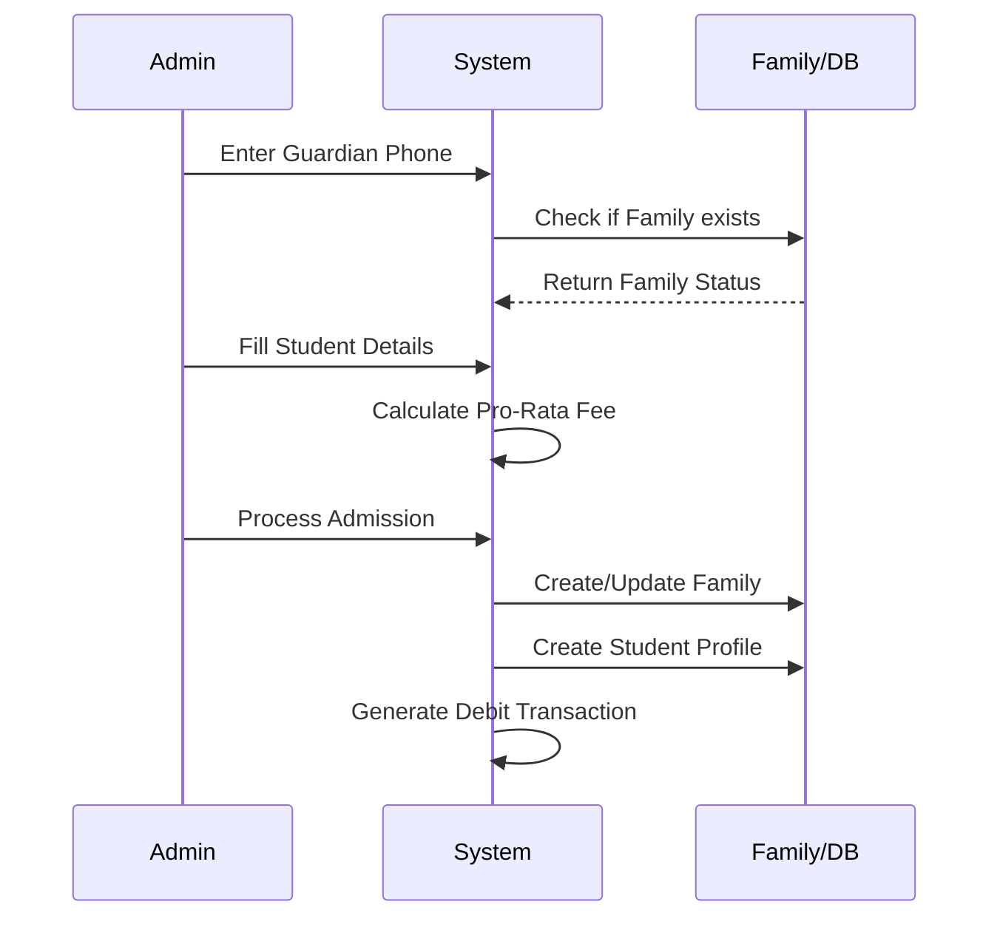

````carousel

<!-- slide -->
### 💡 Intelligent Pro-Rata Calculation
1. **Mid-month joins** trigger an automatic suggestion.
2. **Conflict Flag**: Alerts if joining date is outside billing cycle.
3. **Override**: You can manually adjust the fee amount if needed.
````

> [!WARNING]
> The **Phone Number** is the unique identifier for a family. Reuse the same phone number for siblings to keep them under one billing account.

---

## Student Management

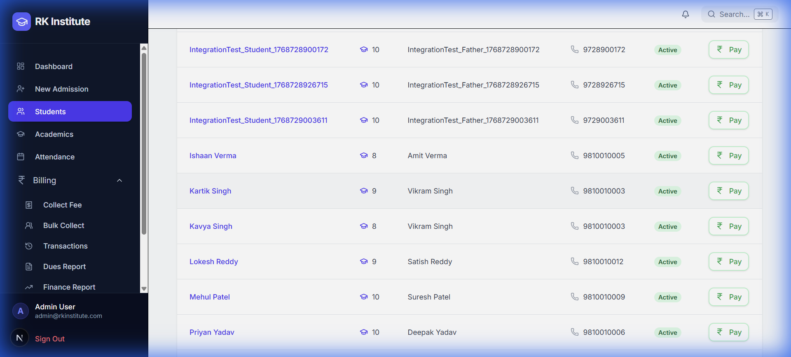

### Accessing Students Page
1. Click **Students** in the sidebar navigation
2. View the complete list of enrolled students

### Students Table Columns

| Column | Description |
|--------|-------------|
| Student Name | Clickable link to student profile |
| Class | Current class/grade level |
| Father Name | Parent/Guardian name |
| Phone | Contact number with phone icon |
| Status | Active (green badge) or Inactive |
| Actions | Pay button for quick fee collection |

### Search & Filtering

- **Search Bar**: Filter by "Name, father, or phone..."
- **Class Filter**: Dropdown to filter by specific class
- **Status Filter**: Filter by Active/Inactive status

### Quick Actions

1. **View Profile**: Click on student name to open detailed profile
2. **Quick Pay**: Click the "Pay" button to collect fees for that student's family
3. **Edit**: Available in student profile page

---

---

## 💳 Fee Collection

````carousel
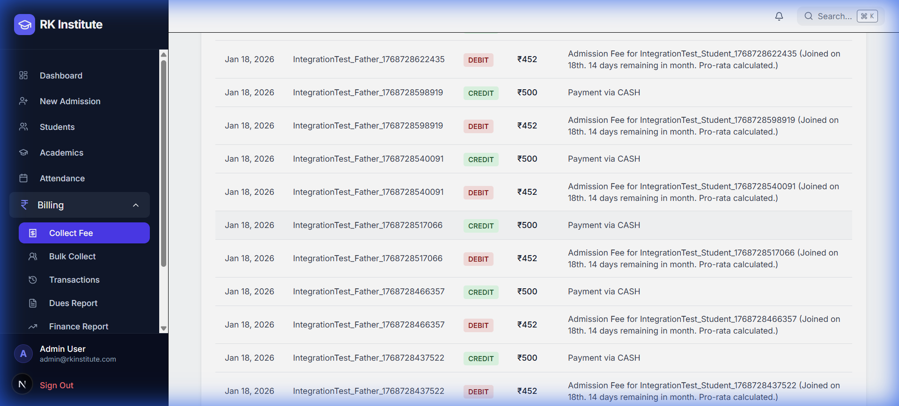
<!-- slide -->
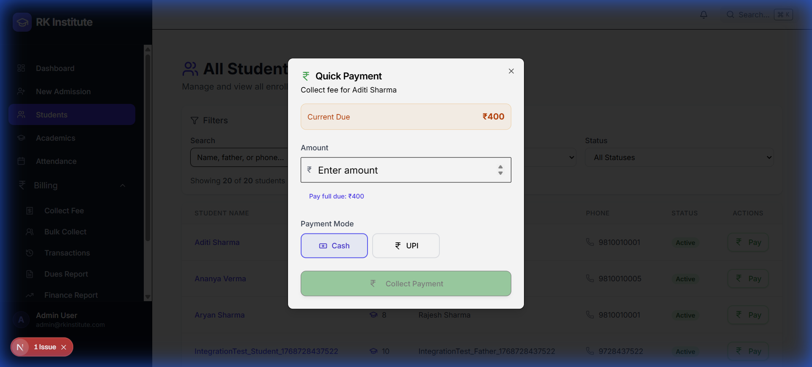
<!-- slide -->
### ⚡ Quick Collection Steps
1. Navigate to **Students**.
2. Click **Pay** on student row.
3. Observe **Current Due** balance.
4. Input **Amount** and **Mode** (Cash/UPI).
5. Confirm to generate receipt.
````

> [!TIP]
> Use the "Pay full due" link in the Quick Payment dialog to save time when collecting the exact outstanding amount.

---

## Dues Report

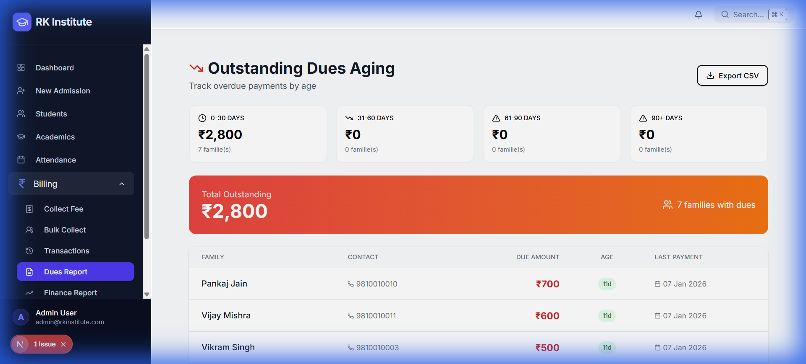

### Accessing Dues Report
1. Click **Billing** in the sidebar
2. Click **Dues Report** to navigate to `/reports/dues`

### Outstanding Dues Aging

The report shows aging buckets at the top:

| Bucket | Color | Description |
|--------|-------|-------------|
| 0-30 DAYS | Green | Recent dues |
| 31-60 DAYS | Yellow | Moderate overdue |
| 61-90 DAYS | Orange | Significantly overdue |
| 90+ DAYS | Red | Critical - long overdue |

### Summary Metrics

- **Total Outstanding**: Sum of all unpaid dues
- **Families with Dues**: Count of families with pending payments

### Dues Table Columns

| Column | Description |
|--------|-------------|
| Family | Parent/Guardian name |
| Contact | Phone number |
| Due Amount | Outstanding balance |
| Age | Days since payment became due |
| Last Payment | Date of most recent payment |

### Export Feature

- Click **Export CSV** button to download the dues list
- Useful for offline analysis and reporting

### Bulk Fee Collection
- Navigate to `/fees/bulk` via **Billing** → **Bulk Collect**
- Select multiple families for batch payment processing

---

## Staff Management


### Accessing Staff Management
1. Click **Staff** in the sidebar navigation
2. The Staff Management page displays all employees

### Page Layout

- **Header**: "Staff Management" with subtitle
- **Add Staff Button**: Top right corner
- **Custom Staff Types**: Banner showing configured types with "Manage" button
- **Staff Table**: List of all staff members

### Staff Table Columns

| Column | Description |
|--------|-------------|
| Name | Staff name and unique ID (e.g., #42) |
| Role | System role + job title (e.g., STAFF/driver) |
| Contact | Phone number |
| Salary | Monthly salary in ₹ |
| Joined | Date when staff was added |
| Status | Active (green) or Inactive badge |
| Actions | Edit (pencil) and Delete (trash) icons |

### Adding New Staff

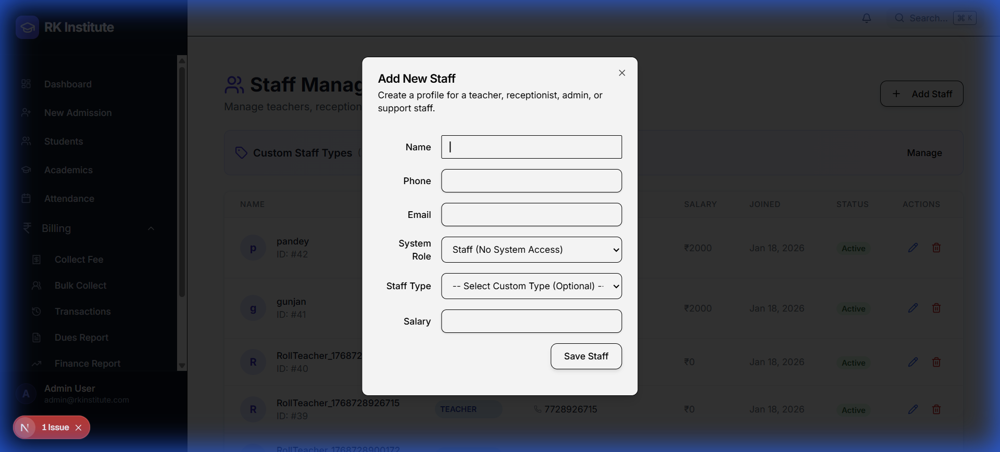

1. Click **Add Staff** button
2. Fill in the form:

| Field | Description | Required |
|-------|-------------|----------|
| Name | Full name of staff member | Yes |
| Phone | Contact number | Yes |
| Email | Email address | No |
| System Role | Dropdown: Admin, Teacher, Receptionist, Staff | Yes |
| Staff Type | Custom type: driver, cook, etc. | Optional |
| Salary | Monthly salary amount | Yes |

3. Click **Save Staff** to create the record

### System Roles

| Role | Description |
|------|-------------|
| Admin | Full system access |
| Teacher | Teaching staff with limited access |
| Receptionist | Front desk operations |
| Staff (No System Access) | Non-admin workers |

### Custom Staff Types

1. Click **Manage** button in Custom Staff Types section
2. View existing types (e.g., driver, cook)
3. Add new type by entering name and clicking **Add Type**
4. Delete unused types

### Editing Staff

1. Click the blue **Edit** (pencil) icon on a staff row
2. Modify details in the dialog
3. Click **Save** to update

### Deleting Staff

1. Click the red **Delete** (trash) icon
2. Confirm the deletion in the alert dialog
3. Staff record is removed

---

## Academics & Batches

## Academics & Batches

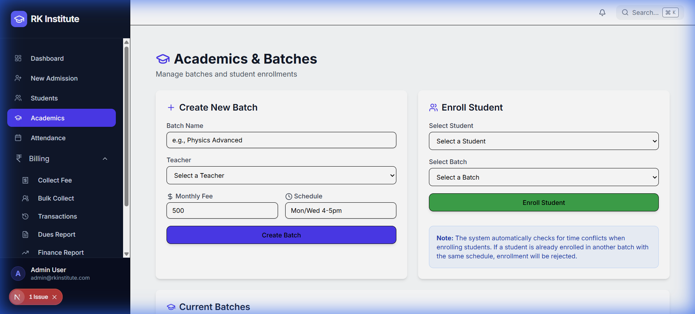

### Accessing Academics
1. Click **Academics** in the sidebar
2. The page allows managing batches and student enrollments

### Creating a Batch
The **Create New Batch** form includes:

| Field | Description |
|-------|-------------|
| Batch Name | Name of the class (e.g., Physics Advanced) |
| Teacher | Select from the dropdown of registered staff |
| Monthly Fee | Monthly tuition amount for this batch |
| Schedule | Class timing details (e.g., Mon/Wed 4-5pm) |

1. Fill in all fields
2. Click **Create Batch** (indigo button)
3. New batch will appear in the **Current Batches** list below

### Enrolling Students in Batch
The **Enroll Student** card provides manual enrollment:

1. Select a **Student** from the searchable dropdown
2. Select a **Batch** from the dropdown
3. Click **Enroll Student** (green button)

> [!NOTE]
> The system automatically checks for time conflicts when enrolling students. If a student is already enrolled in another batch with the same schedule, the enrollment will be rejected.

### Current Batches List

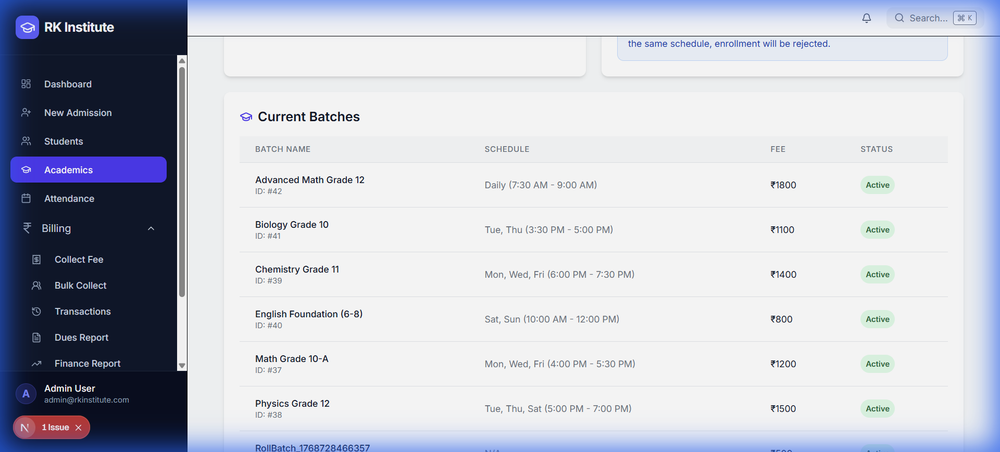

The list displays all active batches with columns for:
- **Batch Name**: Includes unique ID (e.g., #42)
- **Schedule**: Timing details
- **Fee**: Monthly cost
- **Status**: Active badge

---

## Attendance Management


### Accessing Attendance
1. Click **Attendance** in the sidebar navigation
2. Navigate to `/attendance`

### Marking Attendance
1. Select a **Batch** from the dropdown
2. Select the **Date** (defaults to today)
3. The list of enrolled students for that batch appears
4. Toggle each student as **Present** (Green) or **Absent** (Red)
5. Click **Save Attendance** to record the status

### Attendance Summary
- Navigate to a student's profile to view their detailed attendance history
- The dashboard monitors overall attendance trends for the institute

---

## Reports

*This section will be updated during browser testing*

### Available Reports

#### Dues Report (`/reports/dues`)
- View all families with pending dues
- Filter and sort by amount

#### Transactions Report (`/reports/transactions`)
- View all payment transactions
- Filter by date range
- Filter by payment mode

#### Financial Dashboard (`/reports/finance`)
- Revenue analytics
- Trend charts
- Period comparisons

---

## Settings

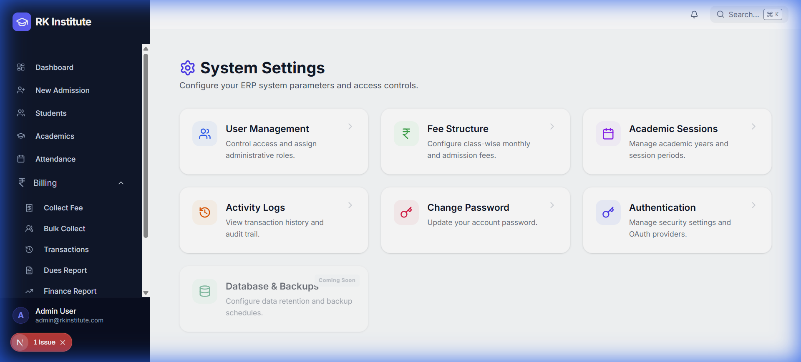

### Accessing Settings
1. Click **Settings** in the sidebar (requires admin access)
2. The System Settings dashboard displays all configuration modules

### Settings Dashboard Modules

| Module | Description |
|--------|-------------|
| **User Management** | Control access and assign administrative roles |
| **Fee Structure** | Configure class-wise monthly and admission fees |
| **Academic Sessions** | Manage academic years and session periods |
| **Activity Logs** | View transaction history and audit trail |
| **Change Password** | Update account security credentials |
| **Authentication** | Manage OAuth providers and security settings |
| **Database & Backups** | Coming Soon - data retention settings |

### Academic Sessions

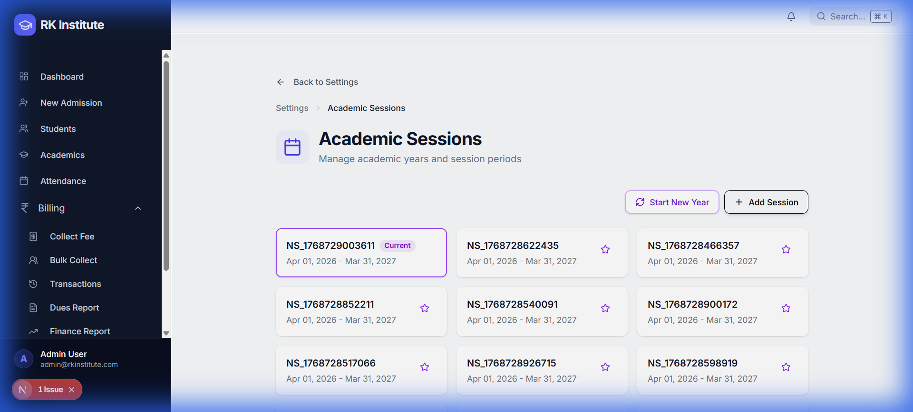

**Accessing Sessions:**
1. Click **Settings** → **Academic Sessions**
2. Or navigate directly to `/settings/sessions`

**Session Cards:**
- Each card shows session name and date range
- Current active session has a **"Current"** badge
- Click session to view details

**Action Buttons:**
- **Start New Year**: Purple button for year-end transition
- **Add Session**: Create a new academic session

### Fee Structure (`/settings/fees`)

1. Navigate to Settings → Fee Structure
2. View class-wise fee configurations
3. Add new fee structure by class
4. Set monthly fee and admission fee amounts

### Authentication (`/settings/auth`)

- Enable/disable Google authentication
- Configure domain restrictions
- Toggle credentials login
- Manage OAuth providers

### User Management (`/settings/users`)

- View all registered users
- Verify new users awaiting approval
- Assign roles (Super Admin, Admin, Staff)
- Edit user permissions

### Audit Logs (`/settings/audit-logs`)

- View system activity logs
- Filter by action type
- Trace changes and modifications
- Export logs for compliance

### Profile (`/settings/profile`)

- View personal profile information
- Update account details
- Change password

---

## Parent Portal

*This section will be updated during browser testing*

### Accessing Parent Portal
- Parents access through a separate URL/login

### Features
- View enrolled children
- Check pending dues
- View payment history

---

## Keyboard Shortcuts

| Shortcut | Action |
|----------|--------|
| `Ctrl + K` | Open Command Palette |
| `Esc` | Close dialogs/modals |

---

## Getting Help

For support or questions:
- Contact your system administrator
- Email: [support email]
- Phone: [support phone]

---

*This manual is being updated as part of QA testing. Screenshots and detailed procedures will be added progressively.*
